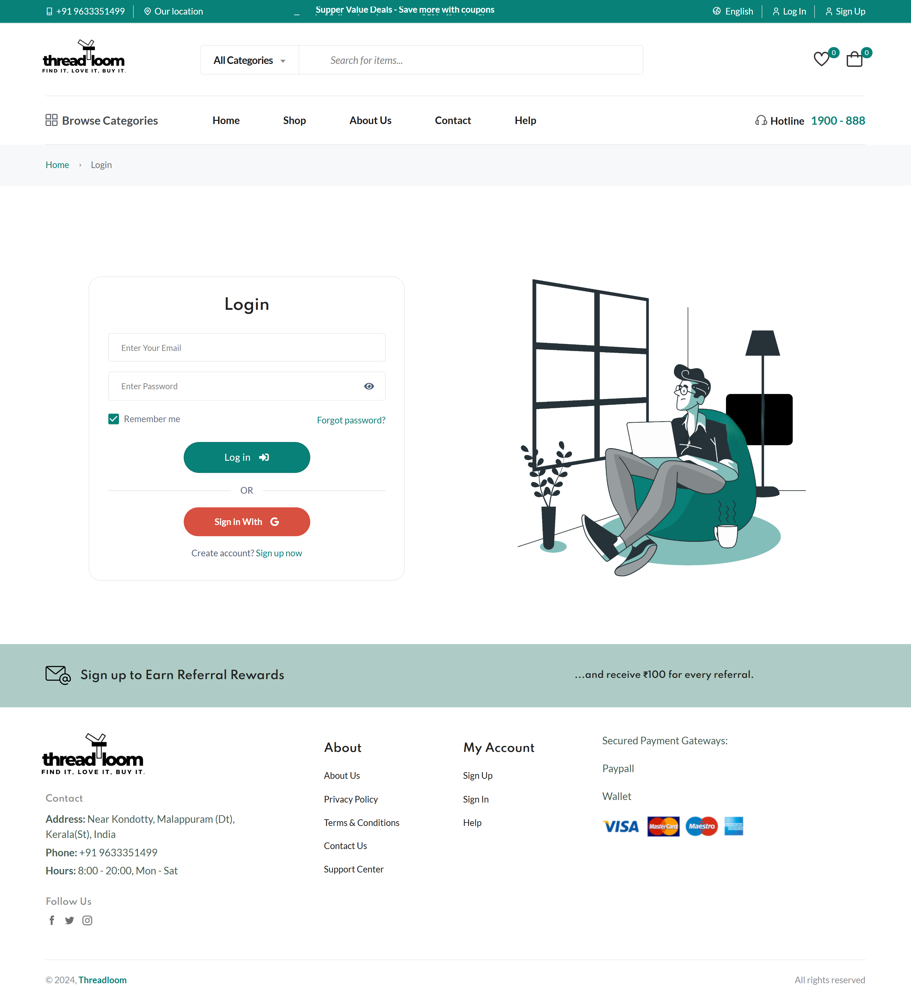
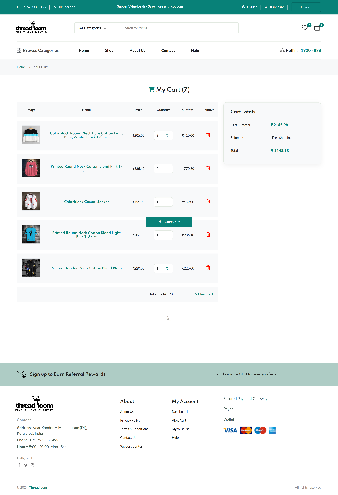
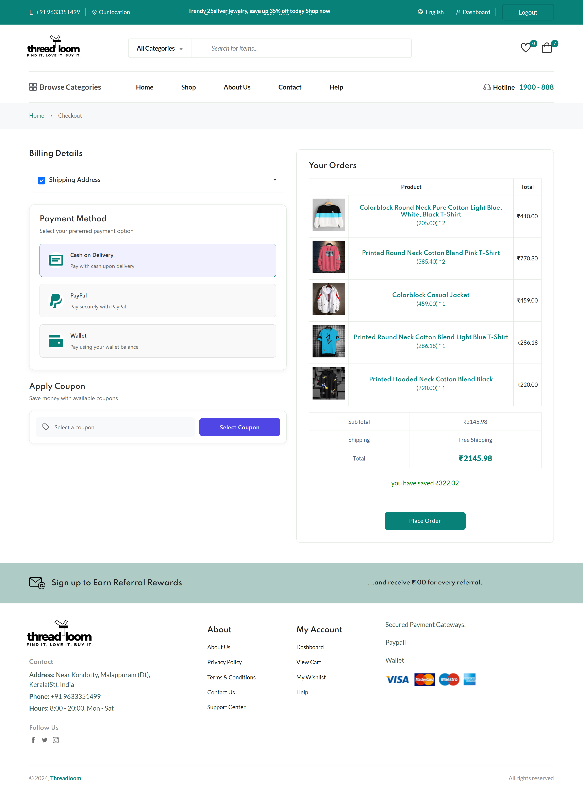
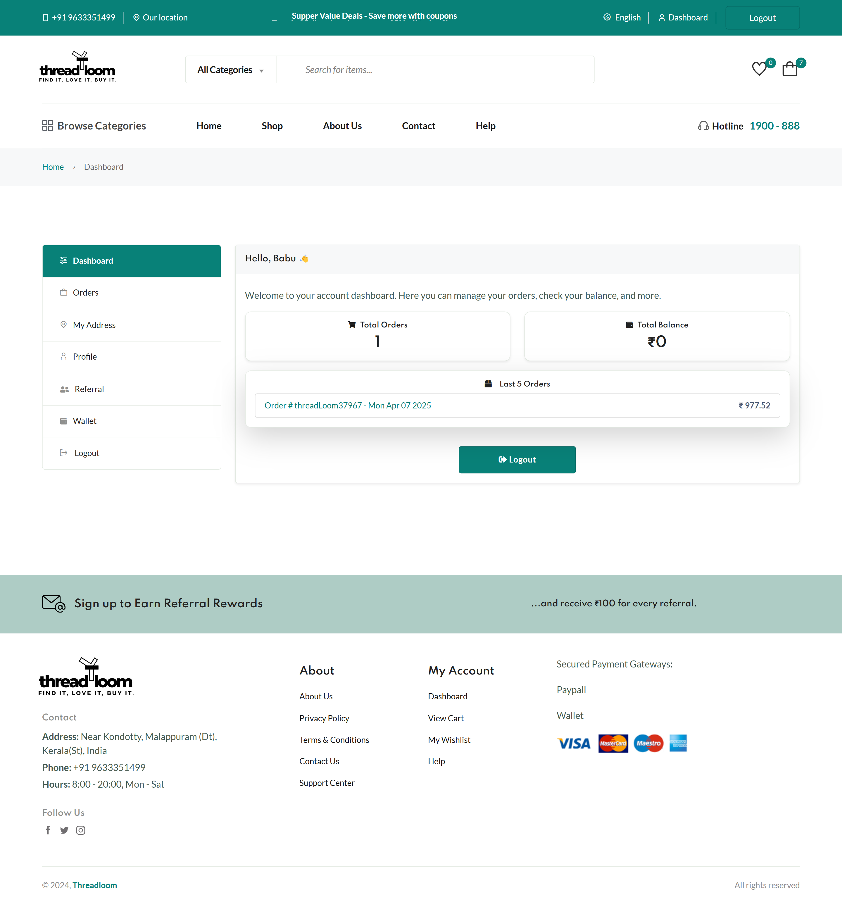
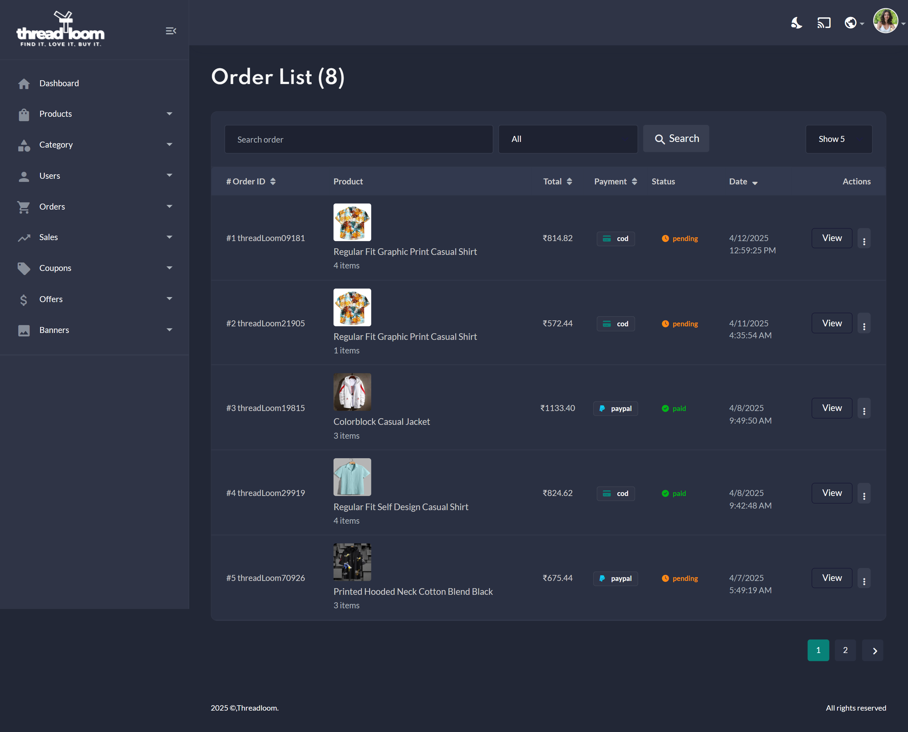
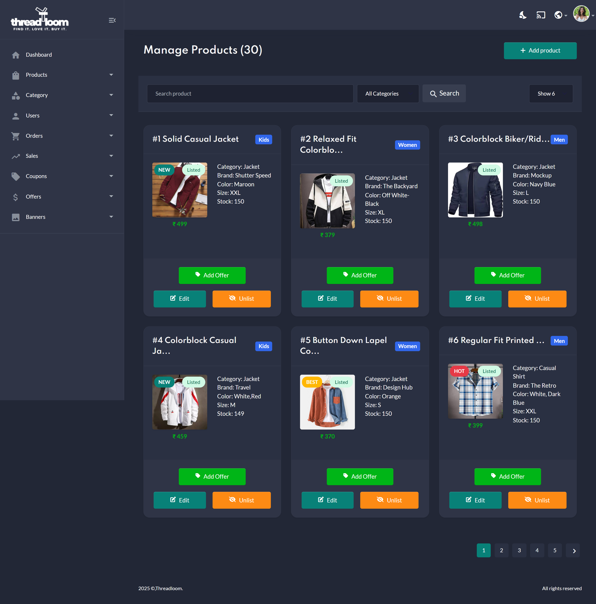
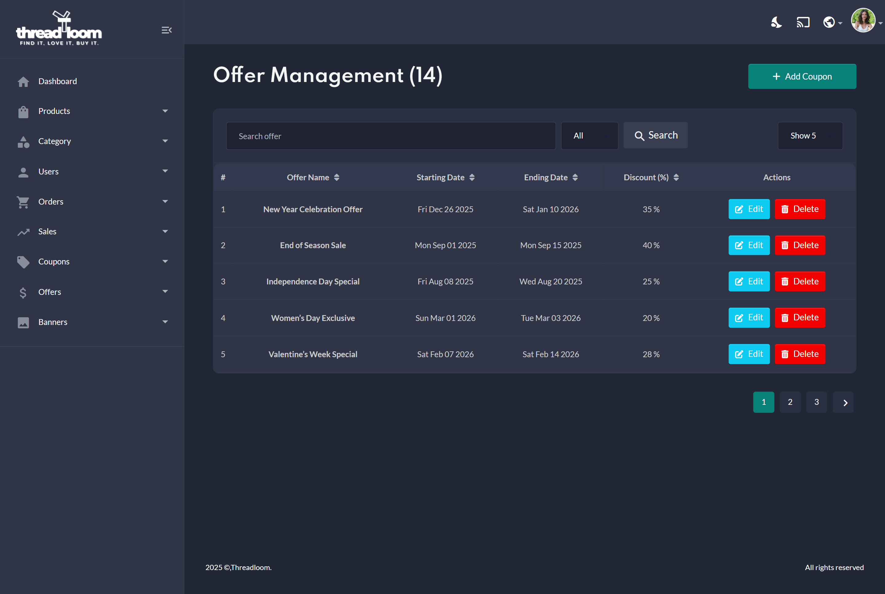

# Threadloom Ecom

A full-featured e-commerce platform built with Node.js and Express. Threadloom Ecom provides all the essential functionalities of an online store with added features for enhanced user experience and robust administrative tools.

---

## Table of Contents

- [Overview](#overview)
- [Features](#features)
- [Demo](#demo)
- [Installation](#installation)
- [Usage](#usage)
- [Technologies Used](#technologies-used)
- [Contributing](#contributing)
- [License](#license)
- [Contact](#contact)

---

## Overview

Threadloom Ecom is designed to deliver a seamless shopping experience while providing administrators with powerful tools to manage inventory, orders, and user interactions. Built on a solid Node.js and Express foundation, the platform supports essential e-commerce functionalities, secure payment options, and extensive reporting capabilities, making it perfect for both small startups and growing businesses.

---

## Features

### 🛍️ User Features

- **Add to Cart & Wishlist:** Easily manage selected and favorite products.
- **Quick View:** Instantly preview product details without leaving the page.
- **Secure Authentication:** Login and register with Email OTP verification for added security.
- **User Dashboard:**
  - Update password and profile info
  - View order history
  - Manage shipping addresses
  - Access wallet and referral system
- **Payment Integration:**
  - Wallet-based payments
  - PayPal support for secure and seamless checkout
- **Product Ratings & Reviews:** Share feedback and rate purchased items.
- **Shop with Filters:** Refine product listings using category, price, etc.

### 🛠️ Admin Features

- **Dashboard with Graphs:** Get insights into sales trends via visual charts.
- **Product Management:**
  - Add, edit, and hide products
- **Category Management:**
  - Add, edit, and hide product categories
- **User Management:**
  - Block or unblock users
- **Order Management:**
  - View orders and update delivery status
- **Sales Reporting:**
  - Export reports as PDF and Excel for analysis
- **Coupon Management:**
  - Add, edit, and delete discount coupons
- **Offer Management:**
  - Add, edit, and delete special offers
- **Banner Management:**
  - Add, edit, and delete homepage banners

---

## Demo

_Example: [Live Demo](https://threadloom.store/)_

### Demo Credentials

| Role  | Email                   | Password    |
| ----- | ----------------------- | ----------- |
| Admin | admin2akhil@gmail.com   | Admin@123   |
| User  | bireca5522@lesotica.com | Bireca5522@ |

> ⚠️ These credentials are for demo purposes only. Please do not use them for real transactions.

## Screenshots

### 🏠 Home Page


### 🔐 Login Page



### 🛍️ Product Listing (Shop)


### 🛒 Cart Page



### 💳 Checkout Page



---

### 🛠️ Admin Dashboard



### 🧾 Order List (Admin)



### 🛒 Product Management (Admin)



### 🎁 Offer List (Admin)



## Installation

### Prerequisites

- [Node.js](https://nodejs.org/) installed on your machine
- MongoDB installation or access to a MongoDB Atlas instance for the database

### Steps

1. **Clone the repository:**

   ```bash
   https://github.com/Akhildas2/threadloom-ecom.git
   ```

2. **Navigate to the project directory:**

   ```bash
   cd threadloom-ecom
   ```

3. **Install dependencies:**

   ```bash
   npm install
   ```

4. **Set up the environment variables (see Configuration(#configuration)).**

5. **Run the Application:**

   ```bash
   npm start
   ```

> ⚠️ The application typically runs at `http://localhost:3000` unless configured otherwise.

## Configuration

To ensure that the application runs smoothly, you must configure several environment variables. Create a .env file in the root of your project directory and add the following:

```bash
PORT=your_port
MONGO_URI=your_mongodb_uri
SESSION_SECRET=your_session_secret
SESSION_NAME=your_session_name
GOOGLE_CLIENT_ID=your_google_client_id
GOOGLE_CLIENT_SECRET=your_google_client_secret
GOOGLE_SIGNUP_CALLBACK_URL=your_callback_url
GOOGLE_LOGIN_CALLBACK_URL=your_callback_url
EMAIL_USER=your_email@domain.com
EMAIL_PASSWORD=your_email_password
PAYPAL_MODE=your_paypal_mode
PAYPAL_CLIENT_ID=your_paypal_id
PAYPAL_CLIENT_SECRET=your_paypal_secret
BASE_URL=your_base_url
MONGODB_URL=your_mongodb_url
```

## Usage

Once the installation is complete, you can start the application and explore:

- **For Users:** Browse products, add items to your cart or wishlist, and complete purchases through secure payment gateways.

- **For Administrators:** Manage products, track orders, and generate insightful reports using the integrated dashboard.

## Technologies Used

- **Backend:** Node.js, Express.js
- **Frontend:** EJS, HTML, CSS, JavaScript
- **Database:** MongoDB
- **Authentication:**Passport (including Google OAuth2 integration)
- **Payment Integration:** Paypal REST SDK and custom wallet integration

- **Other Dependencies**

`axios`, `bcrypt`, `body-parser`, `cookie-parser`, `dotenv`, `exceljs`, `multer`, `nodemailer`, `pdfkit`, `sharp`, and more as detailed in the package.json. [package.json](./package.json)

## Contributing

Contributions are welcome! Follow these steps to contribute to **Threadloom Ecom**:

1. **Fork the Repository** on GitHub.

2. **Create a Feature Branch:**

   ```bash
   git checkout -b feature/my-new-feature
   ```

3. **Commit Your Changes:**
   ```bash
   git commit -am 'Add new feature'
   ```
4. **Push Your Branch:**

   ```bash
   git push origin feature/my-new-feature
   ```

5. **Submit a Pull Request explaining your changes**

> ⚠️ Please ensure your code follows the project's style guidelines and includes tests where appropriate.

## License

This project is licensed under the ISC License. See the [LICENSE](./LICENSE.txt) file for details.

## Contact

For questions, suggestions, or feedback, please reach out:

- **Author:** akhildas.p
- **GitHub:** [Akhildas2](https://github.com/Akhildas2)
- **Email:** akhildasaki12@gmail.com

Happy coding and thank you for exploring Threadloom Ecom!
